# TB Config Studio: user guide

Screenshots were taken from the real app on a masked copy of a test server profile (Steam ids and webhook addresses removed).

## 1. Before you start

1. Start your DayZ server once with the TB mods installed. Each mod writes its config files into `<profile>\TBMods\Config\<Mod>\` the first time it runs.
2. Stop the server before editing. The TB mods read their config files only when the server starts, so every change needs a restart. (Some mods also
   offer an admin reload in game; check that mod's own documentation. The app always tells you to restart.)
3. Start TB Config Studio and open the profile folder: the folder that contains `TBMods`. You can pick it with the folder dialog or type the path.
   A server folder that contains profile folders works too (the app asks which one). Network (UNC) paths are not supported: copy the files to this PC.

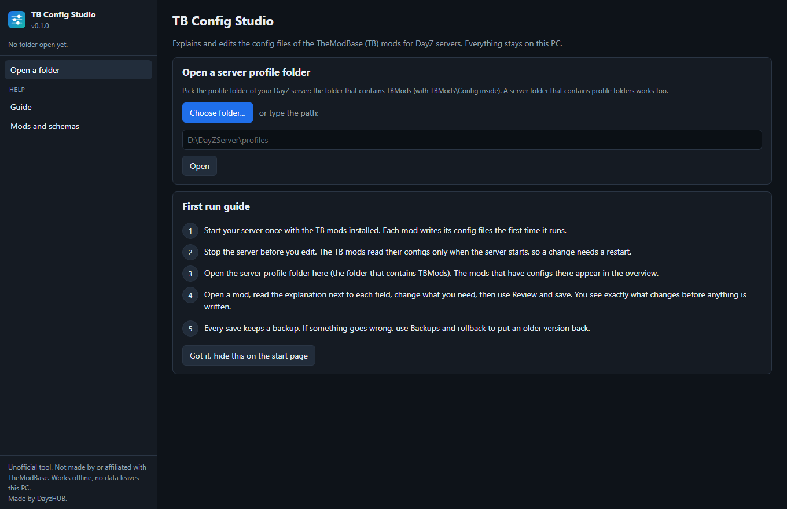

## 2. Overview

The overview lists every TB mod folder found in the profile, how well the app knows it, how many files it has and the config format versions the
mod wrote into its own files. Mods that have no configs yet are listed under "known TB mods have no configs in this folder".

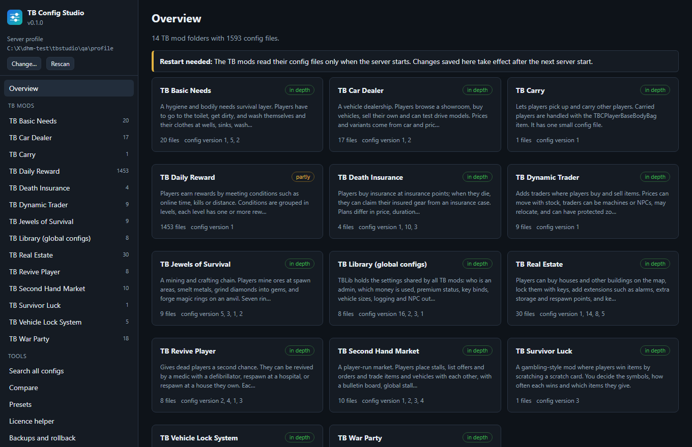

Open a mod to see its files, each with a one-line description.

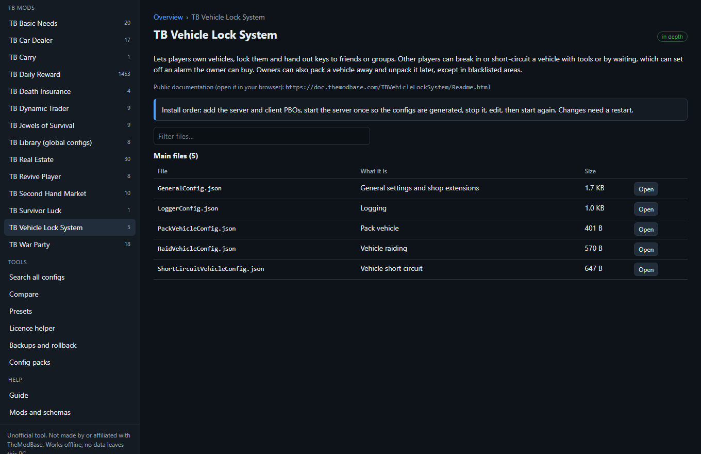

## 3. Editing a file

Each field shows its name, the exact field name in the file, an input suited to its type (a switch for 0/1 values), the unit, a plain-language
explanation, typical values, the allowed range, the default and a warning where something can go wrong. Marks:

- **managed by the mod**: the mod writes this value itself; leave it as it is.
- **expert**: a setting that can break the mod if it is wrong.
- **inferred**: described from the field name only; try it on a test server.
- **not described**: the app has no explanation (for example a setting added by a newer mod version). It is still shown and editable.

Use the filter box to find a field, "Hide advanced and internal" to calm the page, and "Changed only" to review your edits. Lists have Add item,
Duplicate and Remove; objects keyed by a name (for example admins) have Add entry, which starts from a copy of an existing entry.

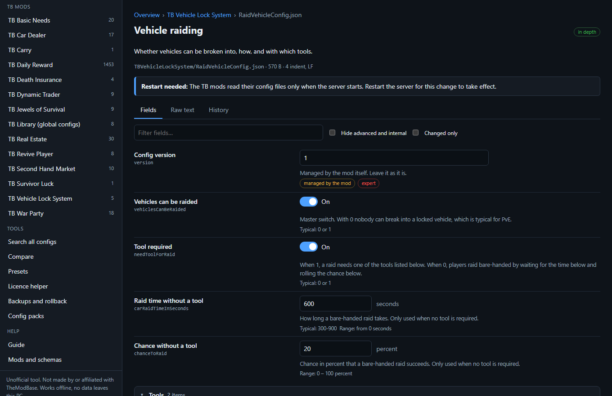

Edited fields are marked and a bar at the bottom counts your changes.

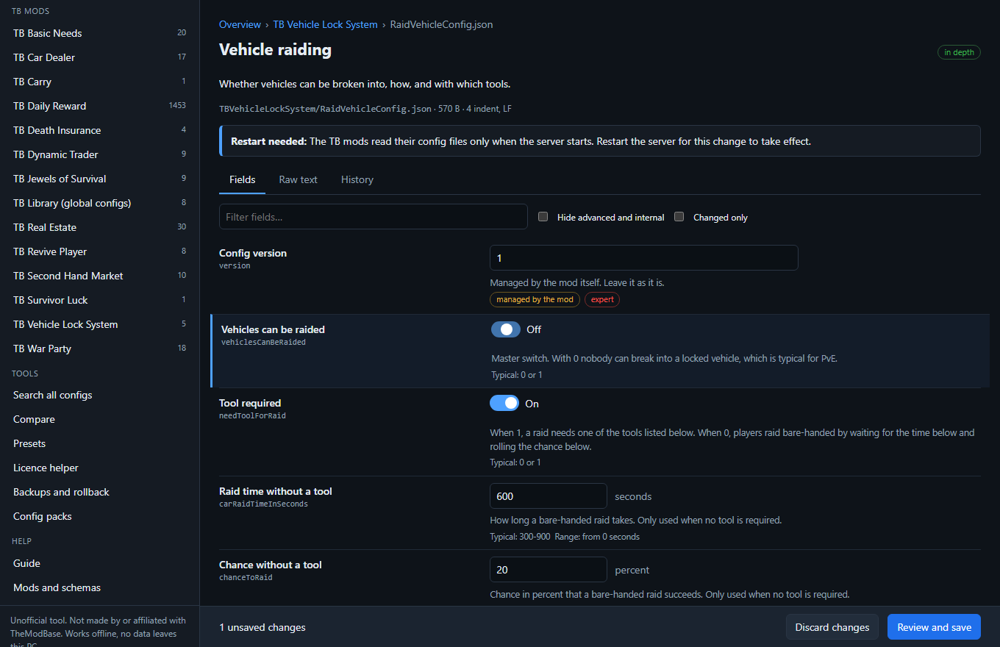

**Review and save** validates the change and shows exactly which lines change. New problems (a value outside its range, the wrong kind of value) block
the save. If the file changed on disk after you opened it, or the server seems to be running (its log changed in the last two minutes), the app asks
before it writes. Before every write the current file is copied to the backups folder; the new file is written in one step.

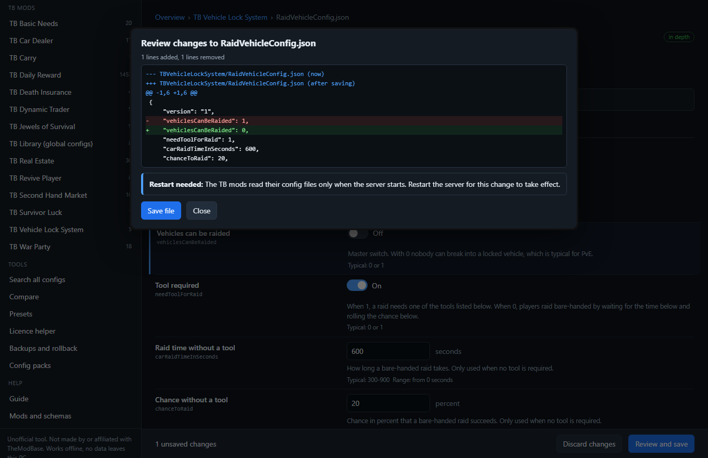

The Raw text tab edits the file as text (not for files that hold secrets). The History tab lists the backups of this file.

Only the values you change are rewritten. Comments, spacing, line endings, the order of keys and the exact spelling of numbers stay as they were.

## 4. Search, compare, presets

**Search all configs** looks through file names, field names, explanations and values of every TB config in the folder (secret values are not searched).

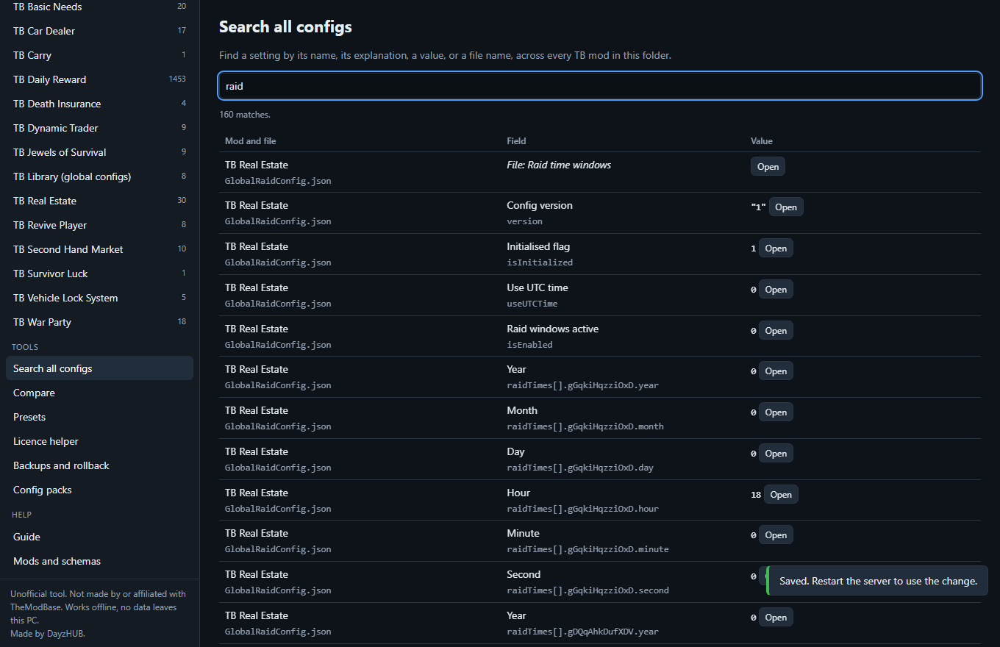

**Compare** lists the differences field by field, against the TB defaults the app knows (only for settings files that exist once per mod) or against
another profile folder. Nothing is changed.

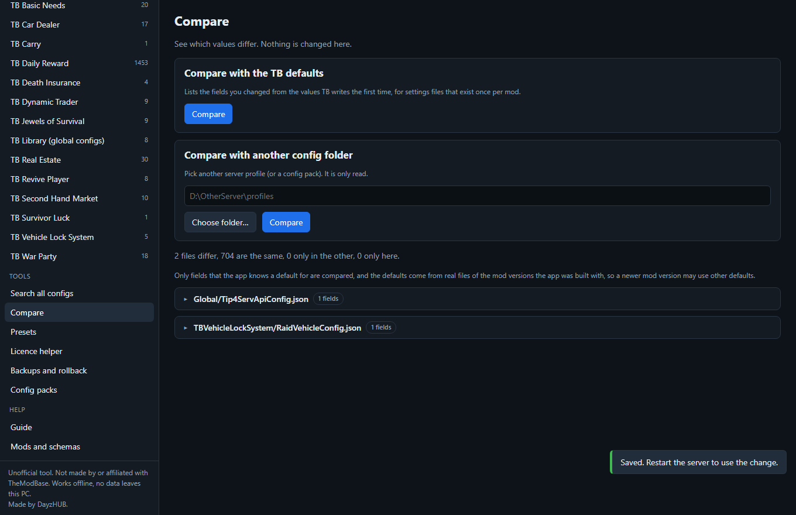

**Presets** are starting points for PvE, PvP, hardcore and casual servers. They are suggestions collected for this app, not official settings of the mod
author. You choose which changes to apply, can show the diff of every file first, and a backup is made before each file is written.

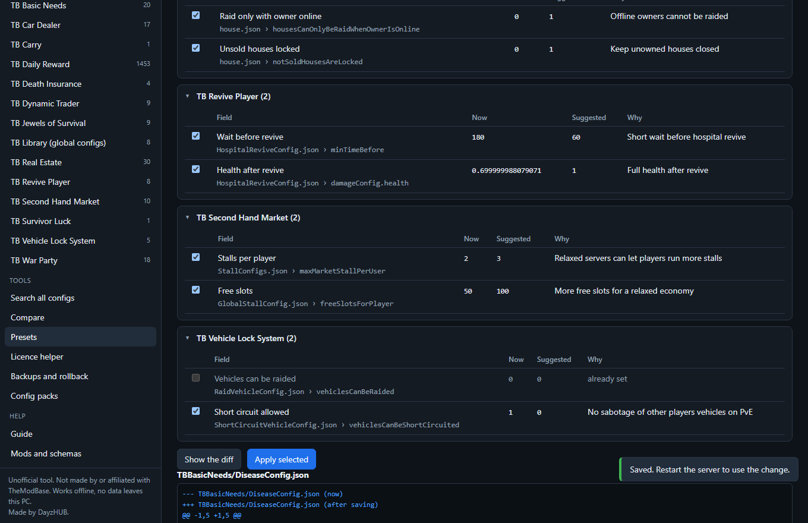

## 5. Licence helper

A TB licence belongs to one server, identified by its public IP address and its game port as registered on the TB website. If the server reaches the
licence check from another address or port, the server shows "Your Server is deactivated". The helper shows what it can see on this PC: the game port
(from `serverDZ.cfg` if it has one, otherwise from `-port=` in a start script in the server folder, with the source named), the IP mode word in
`TheModBase\Config\IPSettings.txt` and whether a licence file exists for each mod. It never reads the content of a licence file, never shows keys and
never contacts a website. A checklist covers the usual causes (wrong IP or port registered, an IP that changed, IPv4/IPv6 mix-up, licence files in the
wrong profile, mods not loaded). The app cannot check a licence for you: only a server start with the licensed mods can.

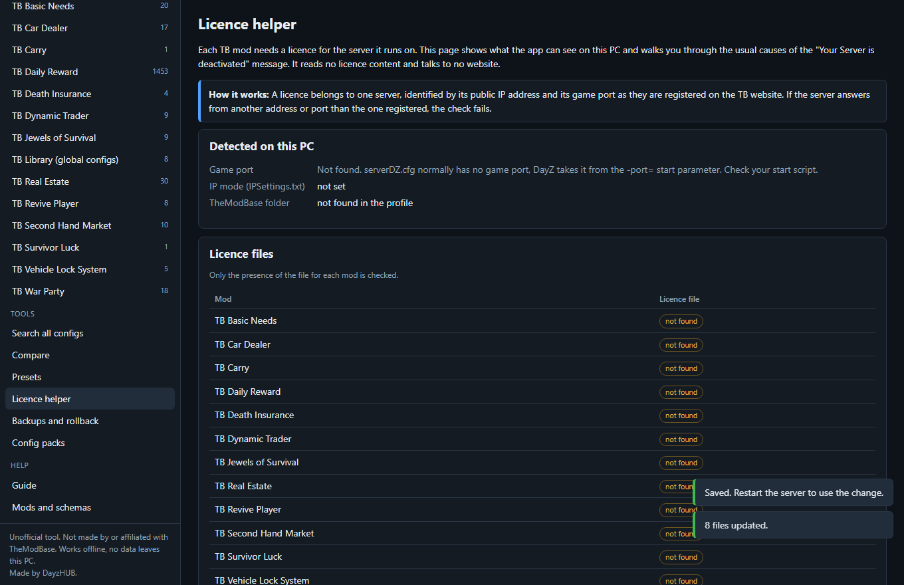

## 6. Backups and rollback

Every write (save, preset, import, restore) first copies the old file to `%LOCALAPPDATA%\TBConfigStudio\backups\<profile id>\<file>\<time>`
(`data\backups` in the portable build); the newest 60 per file are kept. The list shows all backups; pick one to see what restoring would change.
A restore keeps the file it replaces as another backup, so a restore can be undone the same way.

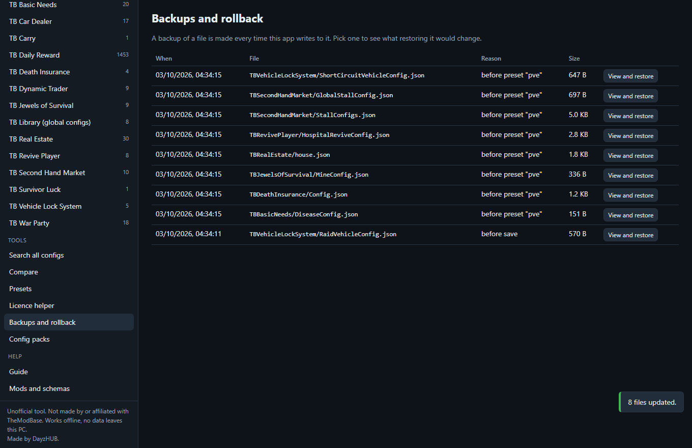
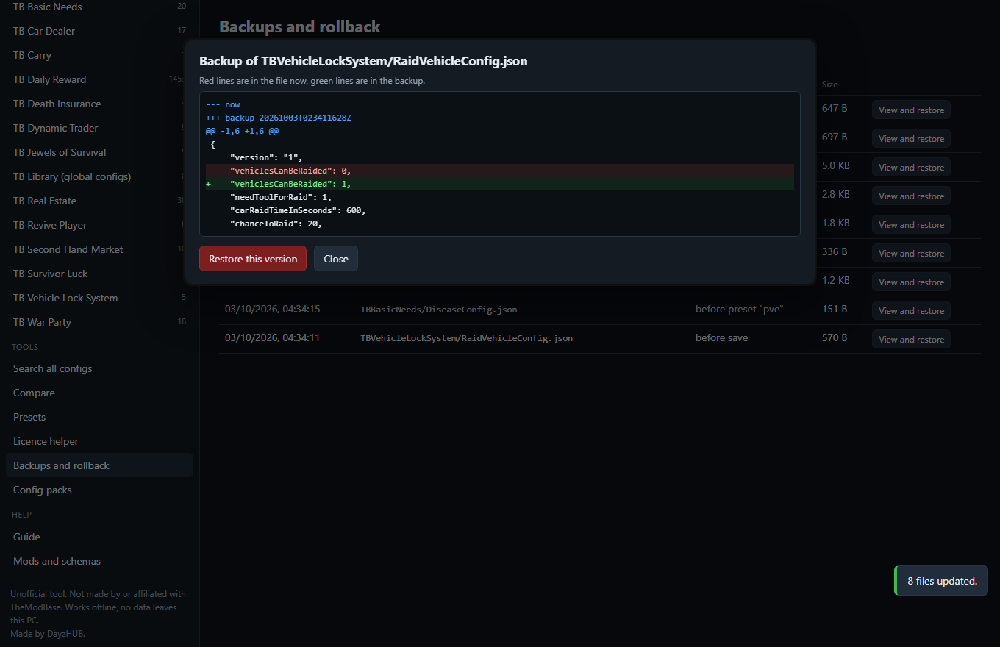

## 7. Config packs

Export writes the chosen mods as a plain folder (`<pack>\TBMods\Config\...` plus a small `tb-config-studio-pack.json`), by default with webhook addresses,
keys and Steam id entries removed. Import takes a pack folder or any other profile folder, shows which files are new or different, and writes only the
ones you tick, each with a backup first. You can also copy a pack into a profile by hand.

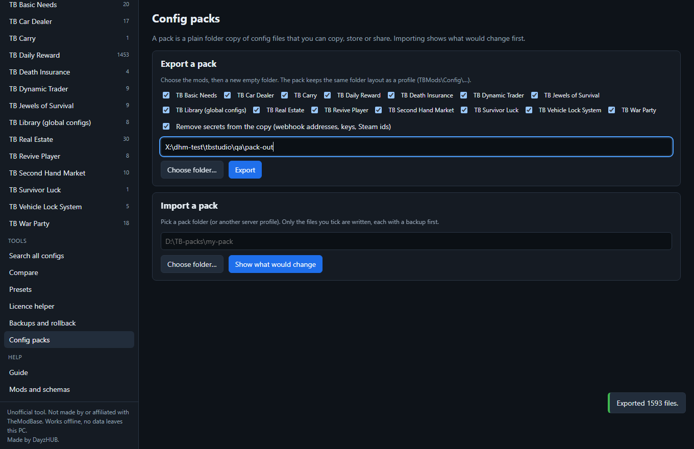

## 8. How well the app knows each mod

"In depth" here means: every field was compared with real config files written by the mods and with the public documentation pages of the mod. It does
not mean the values were tested in game. The documentation was read in summarised form, so a statement marked documented can still be wrong in
a detail; the first real server start tells. Where documentation and real files disagree, the real file's value is the default shown and the
disagreement is noted in the field help.

| Mod | Coverage | File kinds | Fields described | Notes |
|---|---|---|---|---|
| Global (TBLib configs) | in depth | 9 | 72 | admins, currency, premium, logger, key binds, vehicle spawn, NPC gear sets |
| TB Basic Needs | in depth | 9 | 118 | a few fields inferred from the name (health and blood reduction per tick) |
| TB Car Dealer | in depth | 6 | 83 | |
| TB Carry | in depth | 1 | 3 | one setting |
| TB Daily Reward | partly | 6 | 49 | the item, condition and reward-level files are described by their general shape; the sample had more than 1,400 item files |
| TB Death Insurance | in depth | 4 | 56 | documentation defaults differ from the real file for three fields |
| TB Dynamic Trader | in depth | 6 | 119 | stock and price movement is deduced from the real file, the documentation is brief |
| TB Jewels of Survival | in depth | 9 | 288 | what each ring does at each level is not documented and not described |
| TB Real Estate | in depth | 6 | 97 | |
| TB Revive Player | in depth | 8 | 175 | the Premium variants share one description with the normal files |
| TB Second Hand Market | in depth | 10 | 136 | the whitelist semantics are unclear in the documentation (inferred) |
| TB Survivor Luck | in depth | 1 | 13 | |
| TB Vehicle Lock System | in depth | 5 | 89 | |
| TB War Party | in depth | 6 | 142 | four match options are described as future features and may do nothing |

Free mods and any mod not in this list are not described by the built-in files, but their folders still open (values shown, marked "not described").
You can add a description yourself, see `SCHEMA-FORMAT.md`.

## 9. Facts worth knowing (from the public documentation, paraphrased)

- First start: the mods create their files, then you stop, edit and start again. Most mods list a server file set and a client file set; the client set
  plus TBLib goes into the mod pack players download.
- Names must match: a list in one file often names other files (traders to files in `DealerPoints`, reward levels to reward files, arenas, gear sets
  and lobby points to files in their folders; Daily Reward names are case sensitive). Keep the spelling equal to the file name without `.json`.
- Fields called `version`, `isInitialized` and the fields the trader and dealer files write about their current position are managed by the mod.
- Some field names contain a misspelling (for example `...PerMinuted` in Basic Needs). Keep them exactly.
- Times: Dynamic Trader opening hours follow `useUTCTime` (0 server time, 1 UTC); its position and next-move fields are always UTC. Real Estate raid
  windows have the same switch; a year, month and day of 0 means repeating, a weekday rule uses year 1, month 1 and the weekday number as day.
- Real Estate needs `storeHouseStateDisabled = 0` in `serverDZ.cfg`.
- Revive Player: remove "Defibrillator" from `cfgIgnoreList.xml` in the mission folder, otherwise defibrillators disappear after a restart.
- Premium: coins give 30 (gold), 7 (silver) or 1 day (bronze). The file API (`PremiumConfig.json`, `enableAPI`) reads files named
  `<id>_<days>_<Mod>.premium` from the `AddPremium` folder; failed files stay there and are explained in the server log.
- Death Insurance: mods that enlarge inventories can make all gear fail to save; the blacklist does not work when only items in the inventory and
  cargo at the moment of death are insured.
- Daily Reward: renaming a condition lets players claim again; to reset everyone, stop the server and delete `TBMods\Data\TBDailyReward`.
- Adding Death Insurance or Basic Needs to a server with existing persistence can log one-time "scripted variables corrupted" messages for items saved
  before (seen on test servers, see the mods' own notes).

## 10. Where things are

| What | Where |
|---|---|
| Program | `%LOCALAPPDATA%\Programs\TB Config Studio` (installer default) |
| Settings, recent folders, backups, log | `%LOCALAPPDATA%\TBConfigStudio` (portable build: `data` beside the program) |
| Your own mod descriptions | `schemas-user` inside the data folder |

Uninstall from Windows "Installed apps" or with `uninstall.exe` in the program folder. Settings and backups are kept unless you choose to delete them.
